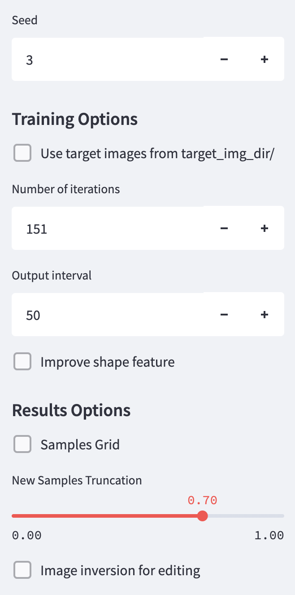

# StyleGAN-nada - quick training & testing app
  
[[Original Repo](https://github.com/rinongal/StyleGAN-nada)]  

> **StyleGAN-NADA: CLIP-Guided Domain Adaptation of Image Generators**<br>
> Rinon Gal, Or Patashnik, Haggai Maron, Gal Chechik, Daniel Cohen-Or <br>
    
<p align="center">
  
</p>
  
## Description  
  
The StyleGAN-nada framework introduces a method where one of two paired StyleGAN2 generators is trained with a CLIP guided loss for a few iterations. I implemented a streamlit interface to visually observe the training and testing of a Stylegan2-ffhq-config-f based model. By doing so, you can explore with an experimental approach some ideas for the source and target classes, without the need to run scripts multiple times or to connect to the official colab notebook demo if you dispose of GPU ressources.
    
The code adapts the a large part of the functionnalities demonstrated in the authors' colab notebook.  
Image inversion currently supports the [ReStyle](https://github.com/yuval-alaluf/restyle-encoder) encoder with a [e4e](https://github.com/omertov/encoder4editing) base model.    


## Setup

The code relies on the official implementation of the [StyleGAN-Nada framework](https://github.com/rinongal/StyleGAN-nada).
Follow the setup instructions there.  
  
In addition, run the following commands:
```shell script
pip install face-alignment PyYAML streamlit
```
  
Make sure to clone the restyle repo with this command:
```shell script
git clone https://github.com/yuval-alaluf/restyle-encoder.git restyle
```
  
- Pretrained StyleGAN2 ffhq generator can be downloaded from [here](https://drive.google.com/file/d/1EM87UquaoQmk17Q8d5kYIAHqu0dkYqdT/view?usp=sharing). Enter its path in the `st_app/app_config.yaml` file for `frozen_gen_ckpt` and `train_gen_ckpt`.
- Pretrained restyle e4e based encoder can be downloaded from [here](https://drive.google.com/file/d/1EM87UquaoQmk17Q8d5kYIAHqu0dkYqdT/view?usp=sharing). Enter its path in the `st_app/app_config.yaml` file for `e4e_ffhq_encode_path`.  

## Usage

Use the following command to run the demo and access it in your browser:

```shell script
streamlit run app.py
```

**Note**: this streamlit application is not developped for production, as you may face gpu memory issues if multiple users access it and train different models at the same time.  
  
Under the main section, you can enter a source and target class:  
  
<p align="center">
  
</p>
  
In addition, there are 3 buttons:  
* Click on *train* to start a number of training iterations for the model. You may click on this button several times if you want to train the model a little more.
* The *new model & source/target* button will re-initialize a fresh new model that can be trained with a new pair of source/target inputs.
* Click on *save model* to create a checkpoint for the current model state.

You can control the main training parameters with the sidebar, as well as activate result modules to test inference with new samples or image inversion editing task:  

<p float="centered">
  
  
  
</p>